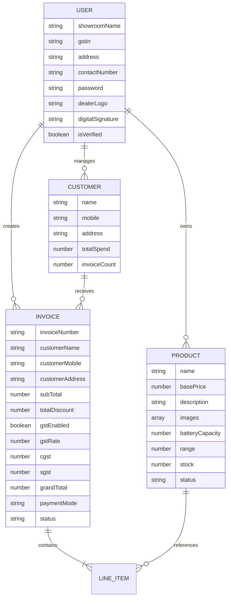

<h1 align="center">⚡ InvoiceFlow</h1>
<p align="center">
  <strong>Smart Dealer Invoice Management Platform</strong><br/>
  <em>Create professional GST-compliant invoices, manage products & customers — all from one dashboard.</em>
</p>

<p align="center">
  <a href="#-features">Features</a> •
  <a href="#%EF%B8%8F-tech-stack">Tech Stack</a> •
  <a href="#-architecture">Architecture</a> 
</p>

---

## 📋 Overview

**InvoiceFlow** is a full-stack web application built for **authorized dealerships** to streamline their day-to-day billing operations. It provides a modern, dark-themed dashboard where dealers can manage their showroom's **products**, **customers**, and **invoices** with full **GST compliance** (CGST/SGST/IGST calculations), **PDF export**, and **real-time analytics**.

The platform is purpose-built for the Indian market with features like GSTIN validation, Indian mobile number verification, INR currency formatting, and amount-to-words conversion in the Indian numbering system (Lakhs/Crores).

---

## ✨ Features

### 🔐 Authentication & Onboarding
- **Multi-step registration** with showroom details, GSTIN validation (`15-char format`), and contact verification
- **OTP verification** flow with auto-expiry and resend capability
- **Dealer logo upload** and **digital signature capture** (canvas-based) during registration
- **JWT-based authentication** with `7-day` token expiry and protected routes
- **Profile management** — update showroom info, logo, and signature anytime

### 📊 Real-Time Dashboard
- **Revenue analytics** — total revenue, GST collected, monthly trends
- **Invoice status breakdown** — generated, draft, cancelled with live counts
- **Interactive charts** — 12-month revenue bar chart and invoice status pie chart (Recharts)
- **Low stock alerts** — products with stock ≤ 5 are flagged automatically
- **Recent invoices feed** — quick-glance view of the latest 10 invoices
- **Quick actions** — one-click navigation to create invoices, add products, or view customers

### 📦 Product Management
- Full **CRUD operations** — create, view, edit, and soft-delete (deactivate) products
- **Multi-image upload** (up to 3 images per product) via Cloudflare R2
- **EV-specific fields** — battery capacity (kWh) and range (km) for electric vehicle dealerships
- **Stock tracking** with real-time inventory counts
- **Search and filter** by name or status (active/inactive)

### 🧾 Invoice Generation
- **Smart invoice creation** modal with multi-line item support
- **Auto-customer lookup** — type a mobile number and get suggestions for existing customers; new customers are auto-created
- **Flexible discounts** — flat (₹) or percentage (%) per line item
- **GST toggle** with selectable rates (`5%, 12%, 18%, 28%`) and automatic CGST/SGST splitting
- **Payment mode selection** — Cash, Card, UPI, Finance, or Cheque
- **Draft / Generate** workflow — save as draft and finalize later
- **Cancel & delete** invoices with automatic stock and customer stat rollback
- **Invoice preview** — full-featured template with dealer branding, line items, tax breakdown, amount in words, and digital signature
- **PDF export** — download print-ready invoices using html2canvas + jsPDF

### 👥 Customer Management
- **Auto-managed customer database** — customers are created automatically from invoices
- **Customer profiles** — view purchase history, total spend, and associated invoices
- **Search** by name or mobile number
- **Edit** customer details (name, mobile, address)
- **CSV export** — download the entire customer list as a `.csv` file
- **Safe delete** — prevents deletion if the customer has associated invoices

### 🎨 Premium UI/UX
- **Dark theme** with glassmorphism cards, gradient accents, and glow effects
- **Framer Motion animations** — smooth page transitions, hover effects, and micro-interactions
- **Responsive sidebar** with collapsible navigation
- **Custom scrollbar** styling and grid pattern overlays
- **Inter + Outfit** font pairing from Google Fonts

---

## 🛠️ Tech Stack

### Frontend

| Technology | Purpose |
|---|---|
| **React 19** | UI library with hooks-based components |
| **Vite 7** | Lightning-fast build tool and dev server |
| **Tailwind CSS 4** | Utility-first styling with custom design tokens |
| **Framer Motion** | Declarative animations and transitions |
| **React Router DOM 7** | Client-side routing with protected routes |
| **Recharts** | Data visualization (bar charts, pie charts) |
| **Axios** | HTTP client for API communication |
| **Lucide React** | Modern icon library |
| **html2canvas + jsPDF** | Client-side PDF generation |
| **react-signature-canvas** | Digital signature capture widget |

### Backend

| Technology | Purpose |
|---|---|
| **Express 5** | REST API framework |
| **Mongoose 9** | MongoDB ODM with schema validation |
| **MongoDB Atlas** | Cloud-hosted NoSQL database |
| **JSON Web Tokens** | Stateless authentication |
| **bcryptjs** | Password hashing (salt rounds: 12) |
| **Multer** | Multipart form-data / file upload handling |
| **AWS SDK (S3 Client)** | Cloudflare R2 object storage integration |
| **dotenv** | Environment variable management |
| **CORS** | Cross-origin resource sharing middleware |

---

## 🏗 Architecture

```
┌───────────────────────────────────────────────────────────────┐
│                        CLIENT (React)                         │
│  ┌──────────┐  ┌──────────┐  ┌──────────┐  ┌──────────────┐  │
│  │  Landing  │  │   Auth   │  │Dashboard │  │   Modals     │  │
│  │   Page    │  │  Pages   │  │  + Pages │  │  (Invoice)   │  │
│  └──────────┘  └──────────┘  └──────────┘  └──────────────┘  │
│         │              │            │              │           │
│         └──────────────┴────────────┴──────────────┘           │
│                         Axios HTTP                             │
└────────────────────────────┬──────────────────────────────────┘
                             │  REST API (JSON)
                             ▼
┌───────────────────────────────────────────────────────────────┐
│                      SERVER (Express)                          │
│  ┌────────────┐  ┌────────────┐  ┌─────────────────────────┐  │
│  │ Middleware  │  │   Routes   │  │       Utilities         │  │
│  │  (JWT Auth) │  │ auth       │  │  uploadR2 (S3 Client)   │  │
│  │            │  │ products   │  │                         │  │
│  │            │  │ invoices   │  │                         │  │
│  │            │  │ customers  │  │                         │  │
│  │            │  │ dashboard  │  │                         │  │
│  └────────────┘  └────────────┘  └─────────────────────────┘  │
│         │              │                     │                 │
│         └──────────────┴─────────────────────┘                 │
│                         Mongoose ODM                           │
└────────────────────────────┬──────────────────────────────────┘
                             │
              ┌──────────────┴──────────────┐
              ▼                             ▼
     ┌──────────────┐             ┌──────────────────┐
     │ MongoDB Atlas │             │  Cloudflare R2   │
     │  (Database)   │             │ (File Storage)   │
     └──────────────┘             └──────────────────┘
```

### Data Models



---

## 🚀 Getting Started

### Prerequisites

- **Node.js** `v18+`
- **npm** `v9+`
- **MongoDB Atlas** account (or a local MongoDB instance)
- **Cloudflare R2** bucket (for file uploads)

### 1. Clone the Repository

```bash
git clone https://github.com/your-username/invoice-generator.git
cd invoice-generator
```

### 2. Setup the Server

```bash
cd server
npm install
```

Create a `.env` file in the `server/` directory:

```env
PORT=5000
MONGO_URI=mongodb+srv://<username>:<password>@cluster.mongodb.net/invoiceflow
JWT_SECRET=your_super_secret_jwt_key
JWT_EXPIRE=7d
R2_ACCOUNT_ID=your_cloudflare_account_id
R2_ACCESS_KEY_ID=your_r2_access_key
R2_SECRET_ACCESS_KEY=your_r2_secret_key
R2_BUCKET_NAME=your_bucket_name
R2_PUBLIC_URL=https://your-bucket-url.r2.dev
```

Start the server:

```bash
node index.js
```

The server will start on `http://localhost:5000` and connect to MongoDB.

### 3. Setup the Client

```bash
cd client
npm install
```

Start the development server:

```bash
npm run dev
```

The client will start on `http://localhost:5173` and proxy API requests to the backend.

### 4. Verify the Setup

Visit `http://localhost:5173` to see the landing page. Hit the **health check** endpoint to confirm the server:

```bash
curl http://localhost:5000/api/health
# → { "status": "ok", "timestamp": "..." }
```

---

## 📡 API Reference

All protected routes require an `Authorization: Bearer <token>` header.

### Authentication

| Method | Endpoint | Description | Auth |
|--------|----------|-------------|------|
| `POST` | `/api/auth/register` | Register a new dealer (multipart) | ❌ |
| `POST` | `/api/auth/verify-otp` | Verify OTP after registration | ❌ |
| `POST` | `/api/auth/resend-otp` | Resend OTP to the user | ❌ |
| `POST` | `/api/auth/login` | Login with contact number & password | ❌ |
| `GET` | `/api/auth/me` | Get current user profile | ✅ |
| `PUT` | `/api/auth/profile` | Update profile (multipart) | ✅ |

### Products

| Method | Endpoint | Description | Auth |
|--------|----------|-------------|------|
| `GET` | `/api/products` | List all products (search, filter) | ✅ |
| `GET` | `/api/products/:id` | Get single product | ✅ |
| `POST` | `/api/products` | Create product (multipart with images) | ✅ |
| `PUT` | `/api/products/:id` | Update product (multipart) | ✅ |
| `DELETE` | `/api/products/:id` | Soft-delete (deactivate) product | ✅ |

### Invoices

| Method | Endpoint | Description | Auth |
|--------|----------|-------------|------|
| `GET` | `/api/invoices` | List invoices (search, filter, date range) | ✅ |
| `GET` | `/api/invoices/:id` | Get single invoice | ✅ |
| `POST` | `/api/invoices` | Create invoice (draft or generated) | ✅ |
| `PUT` | `/api/invoices/:id/cancel` | Cancel an invoice (restores stock) | ✅ |
| `PUT` | `/api/invoices/:id/generate` | Promote draft → generated | ✅ |
| `DELETE` | `/api/invoices/:id` | Permanently delete an invoice | ✅ |

### Customers

| Method | Endpoint | Description | Auth |
|--------|----------|-------------|------|
| `GET` | `/api/customers` | List all customers (search) | ✅ |
| `GET` | `/api/customers/suggest` | Autocomplete by mobile number | ✅ |
| `GET` | `/api/customers/:id` | Get customer profile + invoices | ✅ |
| `PUT` | `/api/customers/:id` | Update customer details | ✅ |
| `GET` | `/api/customers/export/csv` | Export customer list as CSV | ✅ |
| `DELETE` | `/api/customers/:id` | Delete customer (if no invoices exist) | ✅ |

### Dashboard

| Method | Endpoint | Description | Auth |
|--------|----------|-------------|------|
| `GET` | `/api/dashboard/stats` | Get all dashboard analytics data | ✅ |

### Health

| Method | Endpoint | Description | Auth |
|--------|----------|-------------|------|
| `GET` | `/api/health` | Server health check | ❌ |

---

## 📁 Project Structure

```
invoice-generator/
├── client/                          # React Frontend (Vite)
│   ├── public/                      # Static assets
│   ├── src/
│   │   ├── components/
│   │   │   ├── Navbar.jsx           # Landing page navigation
│   │   │   ├── Hero.jsx             # Landing hero section
│   │   │   ├── Features.jsx         # Feature showcase section
│   │   │   ├── HowItWorks.jsx       # How it works section
│   │   │   ├── Pricing.jsx          # Pricing plans section
│   │   │   ├── Footer.jsx           # Landing page footer
│   │   │   ├── DashboardLayout.jsx  # Sidebar + topbar layout wrapper
│   │   │   ├── GenerateInvoiceModal.jsx  # Invoice creation modal
│   │   │   ├── InvoicePreviewModal.jsx   # Invoice preview overlay
│   │   │   └── InvoiceTemplate.jsx  # Printable invoice template
│   │   ├── pages/
│   │   │   ├── LoginPage.jsx        # Dealer login
│   │   │   ├── RegisterPage.jsx     # Multi-step dealer registration
│   │   │   ├── DashboardPage.jsx    # Analytics dashboard
│   │   │   ├── ProductsPage.jsx     # Product CRUD management
│   │   │   ├── InvoicesPage.jsx     # Invoice listing & actions
│   │   │   ├── CustomersPage.jsx    # Customer directory
│   │   │   ├── CustomerProfilePage.jsx  # Individual customer profile
│   │   │   └── ProfilePage.jsx      # Dealer profile settings
│   │   ├── App.jsx                  # Root component with routing
│   │   ├── main.jsx                 # React entry point
│   │   └── index.css                # Global styles & design tokens
│   ├── index.html                   # HTML template with SEO meta
│   ├── vite.config.js               # Vite configuration
│   └── package.json
│
├── server/                          # Express Backend
│   ├── middleware/
│   │   └── auth.js                  # JWT authentication middleware
│   ├── models/
│   │   ├── User.js                  # Dealer account model
│   │   ├── Product.js               # Product catalog model
│   │   ├── Customer.js              # Customer model
│   │   └── Invoice.js               # Invoice + line items model
│   ├── routes/
│   │   ├── auth.js                  # Auth endpoints (register, login, OTP)
│   │   ├── products.js              # Product CRUD endpoints
│   │   ├── invoices.js              # Invoice CRUD endpoints
│   │   ├── customers.js             # Customer endpoints + CSV export
│   │   └── dashboard.js             # Dashboard analytics endpoint
│   ├── utils/
│   │   └── uploadR2.js              # Cloudflare R2 file upload utility
│   ├── index.js                     # Server entry point
│   ├── .env                         # Environment variables
│   └── package.json
│
└── README.md                        # ← You are here
```

---

## 🔒 Security

| Layer | Implementation |
|-------|---------------|
| **Password Hashing** | bcryptjs with 12 salt rounds |
| **Authentication** | JWT tokens via `Authorization: Bearer` header |
| **Route Protection** | `protect` middleware validates token on every request |
| **Input Validation** | Mongoose schema validators (GSTIN regex, phone format, min/max lengths) |
| **File Uploads** | MIME type filtering (images only), 5MB size limit per file |
| **Data Isolation** | All queries scoped to `dealer: req.user._id` (multi-tenant) |
| **Error Handling** | Global error handler for Multer errors, validation errors, and server errors |

---

## 🧰 Key Design Decisions

- **Multi-tenant by default** — Every data model has a `dealer` foreign key. Queries are always scoped to the authenticated user, ensuring complete data isolation between dealerships.
- **Soft-delete for products** — Products are deactivated (`status: 'inactive'`) rather than deleted, preserving historical invoice integrity.
- **Auto-managed customers** — Customers are automatically created when a new invoice is generated with a new mobile number, reducing manual data entry.
- **Indian numbering system** — The `numberToWords` utility converts amounts in the Indian format (Lakhs, Crores) for invoice templates.
- **Cloudflare R2 over S3** — R2 provides S3-compatible storage with zero egress fees, ideal for serving product images and dealer logos.
- **Client-side PDF** — Invoice PDFs are rendered in the browser using html2canvas + jsPDF, eliminating the need for server-side PDF generation infrastructure.

---

## 📄 License

This project is licensed under the **ISC License**.

---

<p align="center">
  Built with ❤️ by <strong>Moin Sheikh</strong>
</p>
